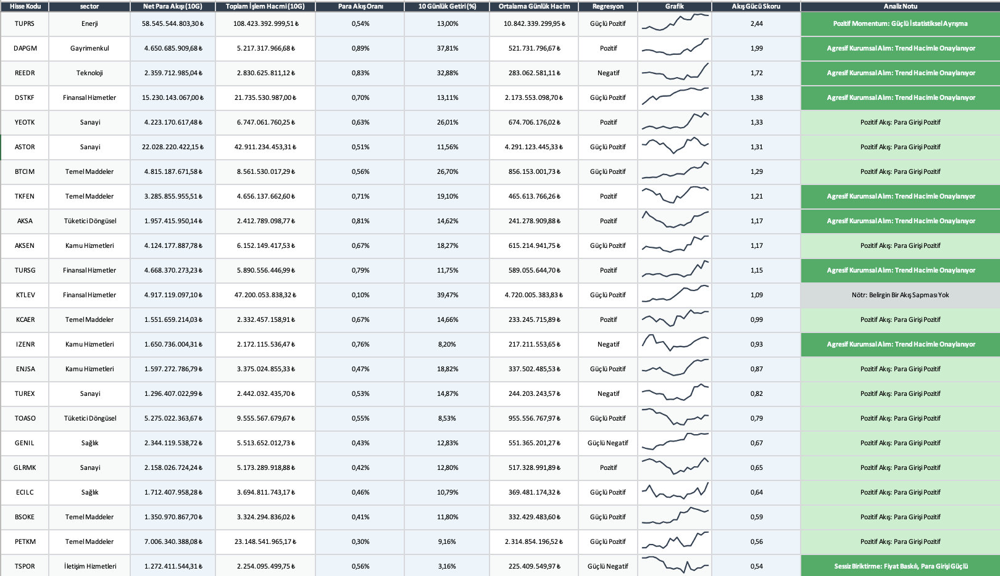
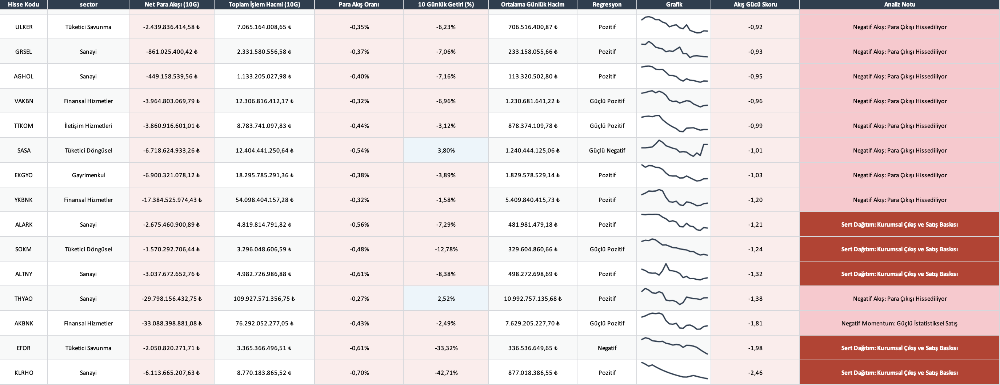
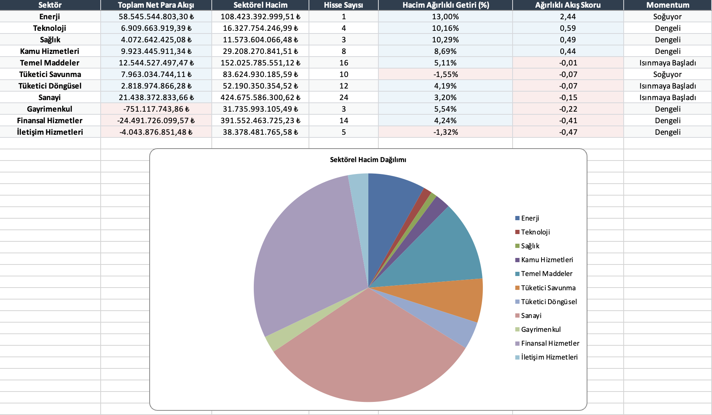

# XU100 Money Flow Engine





Quantitative money flow analysis engine for XU100 stocks with sector-level insights and Excel reporting.

## Overview

This project analyzes short-term capital flow across XU100 stocks and aggregates results at both stock and sector levels.

Instead of focusing only on price, it focuses on capital movement — identifying where money is flowing, accumulating, or exiting.

## Features

- 10-day signed money flow calculation (volume-weighted)
- Flow ratio and statistical z-score normalization
- Composite flow strength scoring system
- Regression-based trend classification (89-period)
- Sector-level capital aggregation
- Excel-based reporting with charts and formatting
- Automatic data fetching via Yahoo Finance

## Output

The script generates a structured Excel report including:

- Stock-level money flow analysis
- Top-ranked stocks based on flow strength
- Sector-level capital flow summary
- Embedded mini price charts (sparklines)
- Conditional formatting for quick interpretation

## Methodology

Core logic:

- Typical price × volume → proxy for capital flow  
- Direction determined by price change  
- Aggregation over rolling 10-day window  
- Normalization using z-score  
- Composite scoring using:
  - flow ratio
  - net flow
  - return  

This creates a relative measure of capital strength across stocks and sectors.

## Example Insight

- Strong positive flow + rising price → momentum supported by capital  
- Strong flow + weak price → possible accumulation  
- Negative flow + high volume → potential distribution  
- Sector-level aggregation reveals rotation between industries  

## Tech Stack

- Python  
- pandas, numpy  
- yfinance  
- matplotlib  
- openpyxl  

## Installation

```bash
pip install pandas numpy yfinance matplotlib openpyxl
